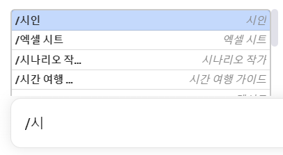

# Legit_Engineers / 모두를 위한 한국어 프롬프트

**안녕하세요, 저희는 GPTers 그룹에서 활동하는 Legit_Engineers입니다.** 
저희는 GPT 커뮤니티에서 활동하며 상대적으로 부족한 한국어 프롬프트를 제공하고
ChatGPT 프롬프트 사용에 익숙하지 않은 분들을 위해 '모두를 위한 한국어 프롬프트 프로젝트' 진행하게 되었습니다.

### 🚀소개
저희는 "**awesome-chatgpt-prompts**"( https://github.com/f/awesome-chatgpt-prompts ) 를 바탕으로 한국어로 번역하여, **Chatgpt 프롬포트 확장_김승우,Ditto,콩 폴더**에서 한국어 ChatGPT 프롬프트 리소스를 제공합니다. 그리고 Desktop용 Chatgpt를 통해 설치가 되면 바로 사용하실 수 있게 제작하였습니다. 

**수정) 초급자들을 위한 프롬프트 외에도 중금, 고급 자들을 위한 프롬프트를 추가하였습니다!**

>초급) 일반 프롬포트 형태로, 간단한 프롬포트들이 준비되어 있습니다.  
중급) 예시를 포함하여 수정할 수 있는 프롬포트들이 준비되어 있습니다.  
고급) 프롬포트 엔지니어링 이론을 토대로 작성된 프롬포트들이 준비되어 있습니다. 

---
먼저 여기서 Desktop용 Chatgpt를 다운받으시길 권장드립니다.  
앱을 사용하면 모든 프롬프트를 쉽게 가져와서 와 같은 슬래시 명령과 함께 사용할 수 있습니다.
https://github.com/lencx/ChatGPT

**더 자세한 설명은 여기를 참고하세요!** https://www.gpters.org/c/ai-tools/desktop-chatgpt

### 📂 구조
**README.md**: 전반적인 설명을 담고 있습니다.

**Chatgpt 프롬프트 확장_김승우,Ditto,콩**: 한국어 사용자를 위한 프롬프트 폴더 입니다.

**설치.bat**: 프롬프트들을 간편하게 설치할 수 있는 배치 스크립트입니다.

**Install 폴더**:
chat.prompt.cmd.json: 프롬프트 확장의 동작과 구성을 위한 설정 파일입니다.
cache_prompts 폴더: 프롬프트 확장에 필요한 캐시 데이터를 저장하고 관리하는 폴더입니다.

### 🛠 설치 및 사용 방법
1. "Chatgpt 프롬프트 확장_김승우,Ditto,콩" 폴더로 이동하세요.
2. 다운 받은 압축 폴더를 풀어 **"설치.bat"** 스크립트를 더블 클릭하여 실행하면 자동으로 프롬프트가 설치됩니다.
3. 필요한 경우 "chat.prompt.cmd.json" 파일을 수정하여 프롬프트 확장의 설정을 변경하세요.
4. '/' 버튼을 사용하여 데스크톱 앱에서 원하는 프롬프트를 사용하실 수 있습니다!

### 📜 프롬프트 파일에 대한 설명
"chat.prompt.cmd.json" 파일은 ChatGPT의 프롬프트 확장에 대한 설정을 담고 있습니다. 
이 파일은 다양한 프롬프트나 명령에 대한 설정을 포함하며, 각 프롬프트는 특정 행동이나 역할을 정의합니다.   
**초급은 이렇게 약 260여개의 다양한 역할 및 프롬프트들이 정의되어 있습니다.**

- 가상 의사
- 개발자 관계 컨설턴트
- 개인 쇼핑객
- 개인 스타일리스트

  ... (중략)
- SVG 디자이너
- Tic-Tac-Toe 게임
- UX/UI 개발자
- Wikipedia 페이지

**중급은 prompt에  "이들 회사의 강점과 약점을 간략하게 설명하십시오. { 예시 - 회사 이름을 입력하십시오}를 표 형식으로 간단히 설명하십시오." 와 같이 예시가 추가 되어 있고**

**고급은 생각의 나무 (tot), 사슬의 사슬 (COT), zero shot 등 프롬포트 엔지니어링 이론을 토대로 작성된 프롬포트들이 준비되어 있습니다.**

각 프롬프트 항목은 다음과 같은 구조를 가집니다:

- act: 프롬프트나 역할의 이름입니다.
- cmd: 사용자가 해당 프롬프트나 역할을 호출하기 위해 사용하는 명령어입니다.
- enable: 프롬프트나 역할이 활성화되어 있는지 나타내는 부울 값입니다.
- prompt: 해당 프롬프트나 역할을 설명하는 텍스트입니다.
- tags: 관련 태그를 포함하는 배열입니다.

#### <구문 예시>
- "act": "개인 스타일리스트",
- "cmd": "개인 스타일리스트",
- "enable": true,
- "prompt": "나는 당신이 내 개인 스타일리스트로 행동하기를 바랍니다. 나는 나의 패션 선호도와 신체 유형에 대해 말할 것이며, 당신은 내가 착용 할 의상을 제안 할 것입니다. 당신은 당신이 추천하는 의상으로 만 답장해야합니다. 설명을 쓰지 마십시오. 첫 번째 요청은 \"공식적인 이벤트가 열리고 복장을 선택하는 데 도움이 필요합니다.\"입니다.",
- "tags": ["Legit_Engineers/김승우, Ditto, 콩"]
      

### 📢 마치며
ChatGPT Desktop 프롬포트 확장은 ChatGPT 한국어 사용자를 위한 프롬프트를 번역한 리소스들을 제공합니다. 
다만, 번역이 완전하진 않으므로 여러분의 참여와 피드백을 기다립니다! 함께 이 프로젝트를 더욱 발전시켜 나가요!

*맥 버전은 곧 추가 업데이트 될 예정입니다.

